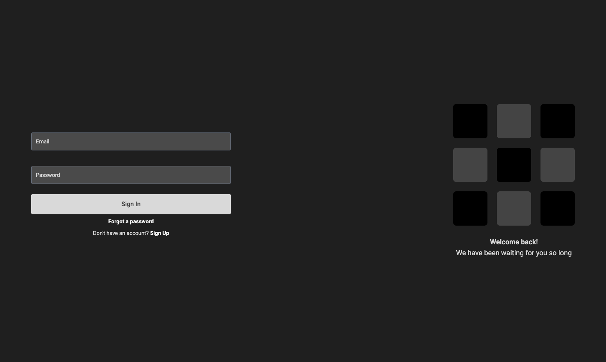
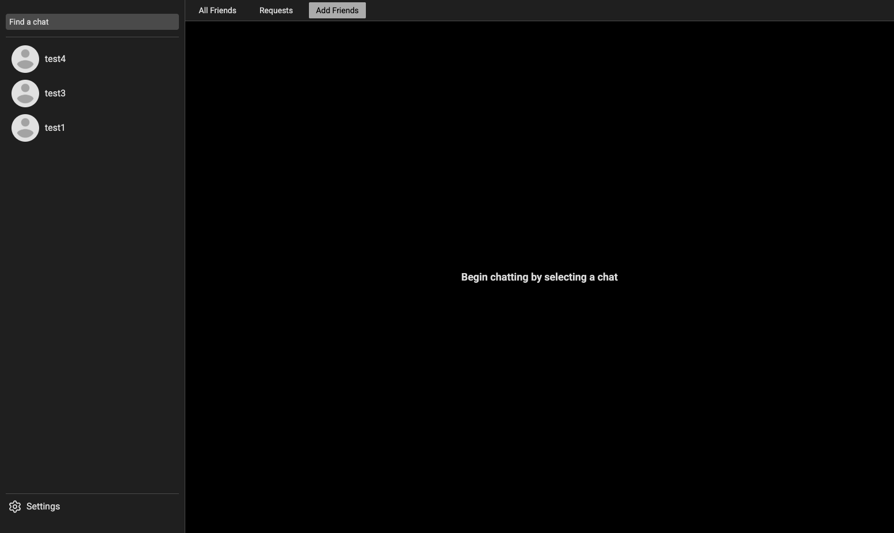

# Realtime Chat App

A full-stack realtime chat application with authentication, direct messaging, friend requests, image attachments, online presence, and password reset emails.




## Features

- Email/password authentication with protected routes
- Realtime one-to-one messaging with Socket.IO
- Friend requests, friend lists, and user discovery
- Message actions such as edit, delete, and mark as seen
- Image uploads for profile photos and message attachments via Cloudinary
- Password reset flow using email links
- Online user tracking

## Tech Stack

- Frontend: React, TypeScript, Vite, Zustand, React Router, Tailwind CSS, Socket.IO client
- Backend: Node.js, Express, MongoDB, Mongoose, Socket.IO, JWT, Nodemailer, Cloudinary

## Project Structure

```text
realtimechatapp/
├── backend/
│   └── src/
│       ├── controllers/
│       ├── jobs/
│       ├── lib/
│       ├── middleware/
│       ├── models/
│       └── routes/
└── frontend/
	└── src/
		├── components/
		├── context/
		├── lib/
		├── pages/
		└── store/
```

## Prerequisites

- Node.js 18 or newer
- MongoDB database
- Cloudinary account
- Gmail account with an app password for outgoing reset emails

## Environment Variables

Create a `.env` file in `backend/` with these values:

```bash
SERVER_PORT=4411
MONGODB_URI=your_mongodb_connection_string
JWTSECRET=your_jwt_secret
GMAIL_APP_PASS=your_gmail_app_password
CLOUDINARY_CLOUD_NAME=your_cloud_name
CLOUDINARY_API_KEY=your_cloudinary_api_key
CLOUDINARY_API_SECRET=your_cloudinary_api_secret
FRONTEND_LINK=localhost:5173
NODE_ENV=development
```

Notes:

- `FRONTEND_LINK` is used in password reset emails. If it is omitted, the app falls back to `localhost:5173`.
- The frontend currently talks to `http://localhost:4411` and `http://localhost:4411/api`, so keep the backend port aligned with `SERVER_PORT` or update the client constants if you change it.

## Installation

Install dependencies separately for the backend and frontend:

```bash
cd backend
npm install

cd ../frontend
npm install
```

## Running Locally

Start the backend:

```bash
cd backend
npm run dev
```

Start the frontend in a second terminal:

```bash
cd frontend
npm run dev
```

The frontend runs on Vite's default port, and the backend listens on the port defined in `SERVER_PORT`.

## Available Scripts

### Root

- `npm run release` - create a standard release
- `npm run prerelease` - create a prerelease

### Backend

- `npm run dev` - start the API with Nodemon

### Frontend

- `npm run dev` - start the Vite dev server
- `npm run build` - type-check and build for production
- `npm run lint` - run ESLint
- `npm run preview` - preview the production build locally

## API Overview

### Auth

- `POST /api/auth/signup`
- `POST /api/auth/signin`
- `POST /api/auth/forgot-password`
- `POST /api/auth/reset-password`
- `POST /api/auth/logout`
- `GET /api/auth/check`
- `PUT /api/auth/update-profile`

### Messages

- `GET /api/messages/users`
- `GET /api/messages/get-messages/:id`
- `GET /api/messages/unread`
- `POST /api/messages/send-message`
- `PUT /api/messages/set-seen/:id`
- `PUT /api/messages/edit-message/:id`
- `DELETE /api/messages/delete-message/:id`

### Friends

- `GET /api/friends/get-users`
- `GET /api/friends/friends`
- `GET /api/friends/requests`
- `POST /api/friends/send-request/:id`
- `PUT /api/friends/manage-request/:id`
- `DELETE /api/friends/delete-friend/:id`

## Realtime Events

- `getOnlineUsers` - broadcast of currently connected users
- `newMessage` - emitted when a new message is created
- `deleteMessage` - emitted when a message is deleted
- `updateUser` - emitted when a user profile changes

## Build Notes

- The backend uses cookie-based auth with JWT.
- Message and profile images are uploaded to Cloudinary.
- Password reset emails are rendered from a Handlebars template in `backend/src/emails/reset.hbs`.
